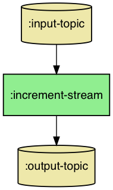

# willa [](https://circleci.com/gh/DaveWM/willa) [](https://clojars.org/willa)
**Alpha**


Willa provides a data-driven DSL on top of the [Kafka Streams DSL](https://docs.confluent.io/current/streams/developer-guide/dsl-api.html), inspired by [Onyx](http://www.onyxplatform.org). It uses [Jackdaw](https://github.com/FundingCircle/jackdaw) under the hood.

Willa is named after [Willa Muir](https://en.wikipedia.org/wiki/Willa_Muir), who translated Kafka's "The Metamorphosis".
Her husband Edwin was also involved, but [apparently he "only helped"](https://en.wikipedia.org/wiki/Willa_Muir).

## Rationale

The Kafka Streams DSL is very "Javaish". 
It uses a `KStreamsBuilder` object to build topologies, which operates by in-place mutation.
This has all the [usual disadvantages](https://clojure.org/about/state#_object_oriented_programming_oo) of mutability, 
including making topologies difficult to compose, test, and visualise.
The built topology is represented as a `ProcessorTopology` object, which can theoretically be used to manipulate the topology. However, it is extremely difficult to work with in practice - not least because the `ProcessorTopology` class isn't documented.
The `KStreamsBuilder` API also re-implements many of the stateless transformation functions from the core Clojure library (`map`, `filter`, `mapcat`, etc.), encouraging needless code duplication.

Willa aims to provide an immutable, data-driven DSL (inspired by [Onyx](http://www.onyxplatform.org)) on top of the Kafka Streams DSL.
It represents all aspects of your topology as Clojure data structures and functions.
This makes topologies far easier to manipulate and compose. For example, if you want to log every message that is published to output topics,
you can write a generic pure function to transform a Willa topology to achieve this.
It also enables you to visualise your topology using GraphViz, which is very useful for reasoning about how a topology works, and also for documentation purposes.

Willa uses transducers for stateless transformations, as opposed to a separate API like with the `KStreamsBuilder`.
Transducers are far more composable, and allow you to re-use code far more effectively.
They also enable you to test your transformation logic completely independently of Kafka (and Willa).

Willa also provides a mechanism for experimenting with a topology from the repl, and seeing how data flows through it.
It can also be used for unit testing. This mechanism is similar in scope to Kafka's `TestTopologyDriver`, but has a few advantages:
1. It gives you the output data of each individual `KStream`/`KTable`/topic within your topology, instead of just the data on the output topics.
2. It enables you to visualise the data flow using GraphViz.
3. It is faster, and doesn't persist anything on disk.


## Getting Started

Willa represents your topology as a map, containing 3 keys:
* `:entities` - an entity is a map containing information about a topic, `KStream`, or `KTable`. The `:entities` map is a map of identifier to entity.
* `:workflow` - a vector of tuples of `[input-entity-id output-entity-id]`, similar to a [workflow in Onyx](http://www.onyxplatform.org/docs/cheat-sheet/latest/#job/:workflow).
* `:joins` - this is a map representing all the joins/merges in your topology as data. It is a map of a vector of entity names involved in the join, to a join config.

This may sound confusing, but let's try to clear things up with a simple example.
Before we start, make sure you have a Kafka broker running locally, either using the [Confluent distribution](https://www.confluent.io/product/confluent-platform) or [Landoop's fast-data-dev docker image](https://github.com/Landoop/fast-data-dev).
Also, if you don't have an existing application, create one by running `lein new my-cool-app`.

Say we want a topology that simply reads messages from an input topic, increments the value, then writes to an output topic.
The topology would look like this:



Start by adding `[willa "0.1.0"]` to your `project.clj`.
Next, we'll require some necessary namespaces:

```clojure
(ns my-cool-app.core
  (:require [jackdaw.streams :as streams]
            [jackdaw.serdes.edn :as serdes.edn]
            [willa.core :as w]))
```

We then create the workflow like so:

```clojure
(def workflow
  [[:input-topic :increment-stream]
   [:increment-stream :output-topic]])
```

You can see that data will flow from the `:input-topic` to the `:increment-stream`, then from `:increment-stream` to the `:output-topic`.
Now we need to tell Willa what exactly the `:input-topic`, `:increment-stream` and `:output-topic` entities are.
To do this, we'll create the entity config map. It looks like this:

```clojure
(def entities
  {:input-topic {::w/entity-type :topic
                 :topic-name "input-topic"
                 :replication-factor 1
                 :partition-count 1
                 :key-serde (serdes.edn/serde)
                 :value-serde (serdes.edn/serde)}
   :increment-stream {::w/entity-type :kstream
                      :willa.core/xform (map (fn [[k v]] [k (inc v)])) ;; Note that the mapping function expects a key-value tuple
                      }
   :output-topic {::w/entity-type :topic
                  :topic-name "output-topic"
                  :replication-factor 1
                  :partition-count 1
                  :key-serde (serdes.edn/serde)
                  :value-serde (serdes.edn/serde)}})
```

That's all the data Willa needs to build your topology! To get our topology up and running, we'll follow these steps:
1. Create a `KStreamsBuilder` object
2. Call the `willa.core/build-topology!` function, passing it the builder, workflow, and entities
3. Create a `KafkaStreams` object from the builder
4. Call `start` on it

The code looks like this:

```clojure
(def app-config
  {"application.id" "my-cool-app"
   "bootstrap.servers" "localhost:9092"
   "cache.max.bytes.buffering" "0"})

(def topology 
  {:workflow workflow
   :entities entities})

(defn start! []
  (let [builder   (doto (streams/streams-builder) ;; step 1
                     (w/build-topology! topology)) ;; step 2
         kstreams-app (streams/kafka-streams builder app-config) ;; step 3
         ]
    (streams/start kstreams-app) ;; step 4
    kstreams-app))
```

You can verify that it works by running the following commands in your repl:

```clojure
(require 'jackdaw.client
         'jackdaw.admin
         'willa.streams)

(def admin-client (jackdaw.admin/->AdminClient app-config))       
;; create the input and output topics
(jackdaw.admin/create-topics! admin-client [(:input-topic entities) (:output-topic entities)])

;; start the topology
(def kstreams-app (start!))

;; create a Kafka Producer, and produce a message with value 1 to the input topic
(def producer (jackdaw.client/producer app-config
                                       willa.streams/default-serdes))                           
@(jackdaw.client/send! producer (jackdaw.data/->ProducerRecord (:input-topic entities) "key" 1))  
                                     
;; create a Kafka Consumer, and consume everything from the output topic                                     
(def consumer (jackdaw.client/consumer (assoc app-config "group.id" "consumer")
                                              willa.streams/default-serdes))
(jackdaw.client/subscribe consumer [(:output-topic entities)])
(jackdaw.client/seek-to-beginning-eager consumer)

;; should return something like: [{:key "key" :value 2}] 
(->> (jackdaw.client/poll consumer 200)
     (map #(select-keys % [:key :value])))                                           
```

## Going Further

One of the cool features of Willa is that you can visualise your topology.
To do this, first make sure you have [graphviz installed](https://bit.ly/2MPXzSO), 
then run these commands in your repl:

```clojure
(require 'willa.viz)

(willa.viz/view-topology topology)
```

A diagram of your topology should pop up in a separate window. 

You can also use Willa to experiment with your Topology. 
For instance, you might want to know what would happen if you receive a message with value `1`. 
To do this, we'll use the `run-experiment` function in the `willa.experiment` namespace.
This function takes a `topology` and a map of entity id to records.
Each record must contain the `:key`, `:value`, and `:timestamp` keys. 
The code looks like this:

```clojure
(require 'willa.experiment)

(def experiment-results
  ;; should return the topology map, but with each entity updated with a :willa.experiment/output key
  (willa.experiment/run-experiment topology
                                   {:input-topic [{:key "some-key"
                                                   :value 1
                                                   :timestamp 0}]}))
                                                 
;; you can now visualise how data flows through the topology in a diagram
(willa.viz/view-topology experiment-results)                                              
```


## Reference
### Entity Config
| Key | Required? | Valid Entity Types | Description |
| --- | --- | --- | --- |
| `:willa.core/entity-type` | ☑ | All | The type of the entity. Can be one of: `:topic`, `:kstream`, `:ktable`, or `:global-ktable`| 
| `:topic-name` | ☑ | `:topic` | The name of the topic |
| `:key-serde` | ☑ | `:topic` | The serde to use to serialize/deserialize the keys of records on the topic |
| `:value-serde` | ☑ | `:topic` | The serde to use to serialize/deserialize the values of records on the topic |
| `:willa.streams/store-name` | ❌ | `:ktable` | The name to give to the state store |
| `:willa.core/xform` | ❌ | `:kstream` | A transducer to apply to the `KStream`|
| `:willa.core/group-by-fn` | ❌ | `:ktable` | A function which takes a key-value pair, and returns the key of the group. If this key is present, `:willa.core/aggregate-adder-fn` and `:willa.core/aggregate-initial-value` must also be provided.|
| `:willa.core/window` | ❌ | `:ktable` | The windowing to apply after grouping the input records. Should be either a [Windows](https://kafka.apache.org/20/javadoc/org/apache/kafka/streams/kstream/Windows.html) or a [SessionWindows](https://kafka.apache.org/20/javadoc/org/apache/kafka/streams/kstream/SessionWindows.html) object. If this key is present, `:willa.core/group-by` must also be provided. Will cause the input to be coerced to a `KStream`|
| `:willa.core/aggregate-initial-value` | ❌ | `:ktable` | The initial value to use in an aggregation. Must be provided if `:willa.core/aggregate-adder-fn` is present|
| `:willa.core/aggregate-adder-fn` | ❌ | `:ktable` | The aggregator function if the input is a `KStream`, or the ["adder" function](https://kafka.apache.org/20/javadoc/org/apache/kafka/streams/kstream/KGroupedTable.html#aggregate-org.apache.kafka.streams.kstream.Initializer-org.apache.kafka.streams.kstream.Aggregator-org.apache.kafka.streams.kstream.Aggregator) if it is a `KTable`. If this key is present, `:willa.core/group-by` must also be provided.|
| `:willa.core/aggregate-subtractor-fn` | ❌ | `:ktable` | The aggregate ["subtractor" function](https://kafka.apache.org/20/javadoc/org/apache/kafka/streams/kstream/KGroupedTable.html#aggregate-org.apache.kafka.streams.kstream.Initializer-org.apache.kafka.streams.kstream.Aggregator-org.apache.kafka.streams.kstream.Aggregator-), only valid if the input is a `KTable`. If this key is present, `:willa.core/group-by` must also be provided.|
| `:willa.core/suppression` | ❌ | `:ktable` | A [Suppressed](https://docs.confluent.io/current/streams/javadocs/org/apache/kafka/streams/kstream/Suppressed.html) object that determines how updates to the `KTable` are emitted. See [the Kafka Streams docs](https://docs.confluent.io/current/streams/javadocs/org/apache/kafka/streams/kstream/KTable.html#suppress-org.apache.kafka.streams.kstream.Suppressed-) for more info|

### Join Config
| Key | Description |
| --- | --- |
| `:willa.core/join-type` | The type of the join. Can be one of `:merge`, `:left`, `:inner` or `:outer`.|
| `:willa.core/window` | A [JoinWindows](https://kafka.apache.org/20/javadoc/org/apache/kafka/streams/kstream/JoinWindows.html) object that specifies the windowing to be used in the join. Not used when the join type is `:merge` or when joining a `:kstream` and a `:global-ktable` |     
| `:willa.core/kv-mapper` | The [kv-mapper function](https://kafka.apache.org/20/javadoc/org/apache/kafka/streams/kstream/KeyValueMapper.html) to use when joining a `:kstream` with a `:global-ktable`. Extracts a key of the GlobalKTable from each `[k v]` of the stream. If not specified, the key of the stream is used. Not used when joining other kinds of objects. See [the Kafka Streams docs](https://kafka.apache.org/20/javadoc/org/apache/kafka/streams/kstream/KStream.html#join-org.apache.kafka.streams.kstream.GlobalKTable-org.apache.kafka.streams.kstream.KeyValueMapper-org.apache.kafka.streams.kstream.ValueJoiner-) for more info |     

## License

This program and the accompanying materials are made available under the
terms of the GPL V3 license, which is available at https://www.gnu.org/licenses/gpl-3.0.en.html.
